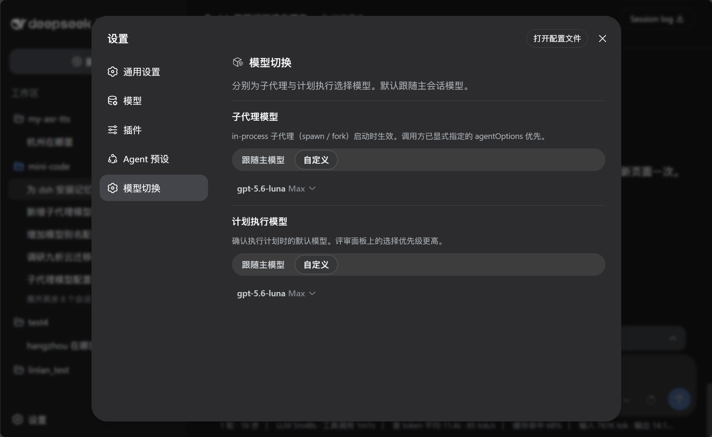
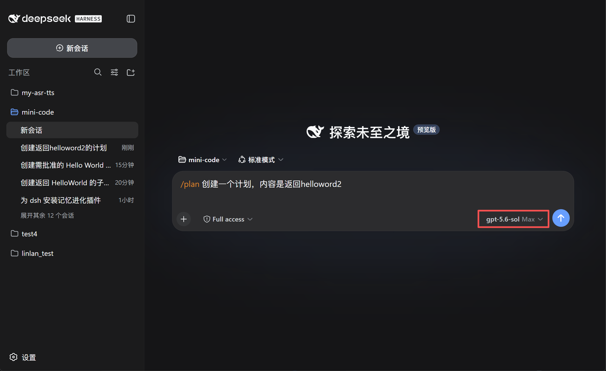
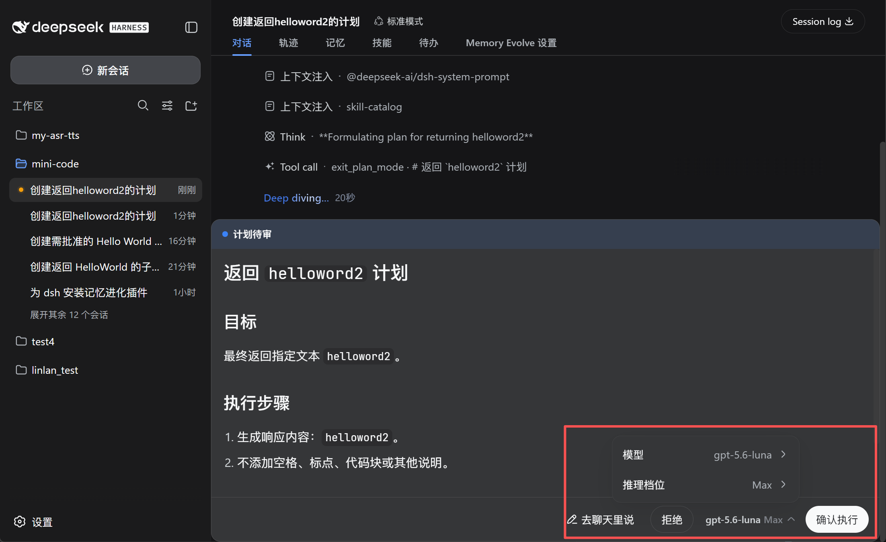
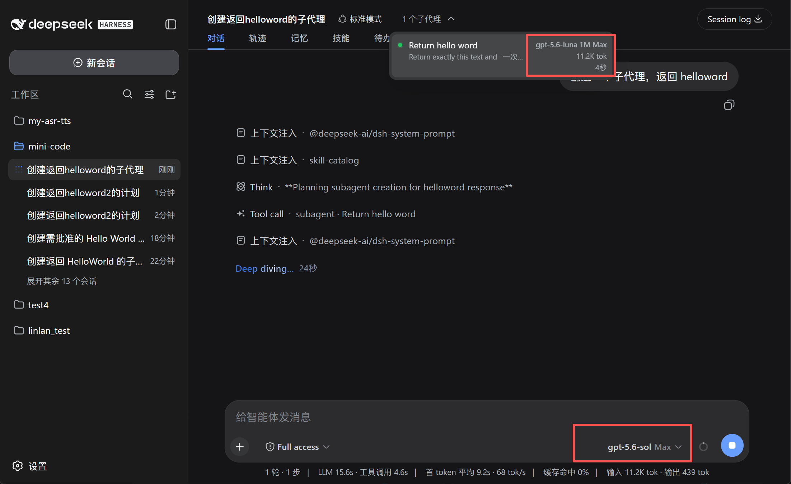
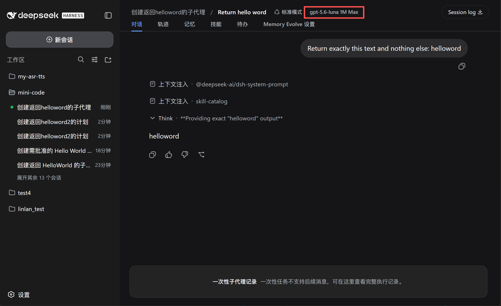

# dsh-model-switch

[English](README.md) | 中文

为 DeepSeek Harness 的不同工作阶段选择更合适的模型。

主会话、子代理和计划执行承担的任务不同，一个模型未必适合所有场景。`dsh-model-switch` 让它们可以分别使用合适的模型，同时保留原有的 DSH 使用流程。

## 为什么使用

- **按任务选择模型**：主会话保留熟悉的模型，子代理和计划执行可使用更适合各自任务的模型。
- **减少重复切换**：设置一次默认选项，不必在每次任务开始前手动改模型。
- **执行前仍可确认**：在计划待审面板中查看或调整本次执行使用的模型。
- **清楚子代理在用什么**：显示模型、上下文窗口和思考等级，例如 `GPT-5.6 Sol 1M Max`。
- **不影响主会话选择**：计划执行结束后，DSH 会恢复原来的主会话模型。

## 使用效果

### 设置默认模型



### 选择计划执行模型

<table>
  <tr>
    <td width="50%"></td>
    <td width="50%"></td>
  </tr>
</table>

### 查看子代理使用的模型

<table>
  <tr>
    <td width="50%"></td>
    <td width="50%"></td>
  </tr>
</table>

## 安装

请使用 GitHub 安装源。本插件未发布到 npm，不要使用 `@lincong1987/dsh-model-switch`。

```bash
dsh plugin --profile web add github:lincong1987/dsh-model-switch
```

将 `web` 换成 DSH 实际正在使用的 profile。DeepSeek Harness Desktop 一般是 `desktop`。

安装完成后重启 DSH。

## 如何更新 DSH

本插件需要 DeepSeek Harness **0.1.0-rc.8** 或更高版本。DSH 没有 `dsh update` 命令，按你当初的安装方式再装一次目标版本即可。

1. 查看当前版本，以及 npm 上实际发布的标签：

```bash
dsh --version
npm view @deepseek-ai/dsh dist-tags
```

`latest` 可能落后于预发布版。截至撰写时，`latest` 是 `0.1.0-rc.7`，`next` 是 `0.1.0-rc.8`。请按版本号安装（`@0.1.0-rc.8` 或 `@next`）；只装 `@latest` 拿不到 rc.8。

2. **npx（Web）：**

```bash
npx --yes @deepseek-ai/dsh@0.1.0-rc.8 web
```

3. **全局 npm 安装：**

```bash
npm install -g @deepseek-ai/dsh@0.1.0-rc.8
dsh --version
```

然后重启 `dsh web`。DSH 需要 Node.js `^22.19.0` 或 `>=24`。

4. **Desktop：** 先从托盘完全 **退出**，再在应用里使用 **检查更新**（或安装更新的 Desktop 安装包）。Desktop 自带一份打包好的 `dsh`，更新 npm / `npx` 不会替换这份副本。Desktop 更新完成后请再重启一次。

DSH 仍处于开发者预览阶段，版本之间可能改磁盘存储格式。跨版本升级前请备份 `~/.dsh`（Windows：`%USERPROFILE%\.dsh`）。

DSH 升到兼容版本后，按下一节重装本插件。

## 重装 / DSH 更新后如何安装

在本仓库有新版本，或你升级了 DeepSeek Harness 之后，请重装插件。插件会跟随特定 DSH 版本（当前为 **0.1.0-rc.8** 或更高），宿主升级后应再装一次插件。

1. 先更新 DSH（见 [如何更新 DSH](#如何更新-dsh)；如果只是插件更新，可跳过这一步）。
2. 使用 `--force` 重装，让 DSH 重新拉取 GitHub 源：

```bash
dsh plugin --profile web add --force github:lincong1987/dsh-model-switch
```

3. 重启 DSH。

在 Desktop 上，一次只执行 **一条** `plugin add`。请从托盘完全 **退出**（只关窗口不够），等 Desktop 启动完成后再重装，然后再次退出并重新打开。如果安装报错 `another plugin install recovery transaction is pending`，先退出 Desktop，等它完成启动后再试一次。若仍然卡住，退出 Desktop，删除 `%APPDATA%\DSH Desktop\plugin-install-recovery`，重新打开后再执行一次 `add --force`。

若要绕过 Desktop 包装器，可在普通终端里直接跑对应版本的 DSH CLI：

```powershell
npx --yes @deepseek-ai/dsh@0.1.0-rc.8 plugin --profile desktop add --force github:lincong1987/dsh-model-switch
```

## 使用

1. 打开 **设置 → 模型切换**。
2. 分别配置 **子代理模型** 和 **计划执行模型**：
   - **跟随主模型**：使用当前主会话模型。
   - **自定义**：选择模型和思考等级。
3. 创建计划后，在计划待审面板中确认或调整执行模型，再点击 **确认执行**。

计划待审面板中的选择优先于设置中保存的计划执行模型。

## 兼容性

需要 DeepSeek Harness **0.1.0-rc.8** 或更高版本。设置通过插件注册的 `model-switch` 命名空间写入宿主设置文档。

子代理模型切换适用于 `spawn`、`fork` 等进程内子代理。外部进程代理可能独立管理自己的模型。

## 交流


## 友情链接

- [Linux.do 社区](https://linux.do)

## 许可证

MIT
